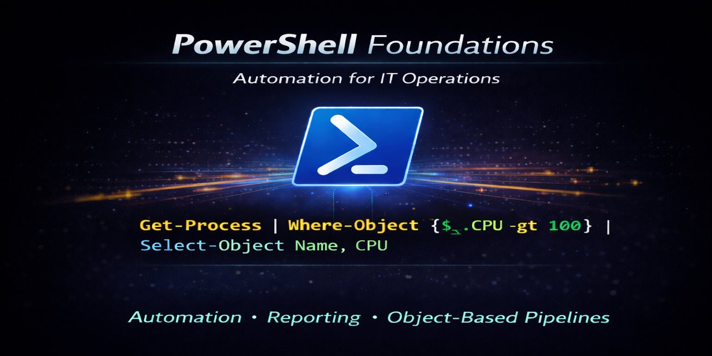

## Operational Relevance (IT Operations and Automation)

This project demonstrates fundamental PowerShell skills relevant to IT Support, IT Operations, and Systems Administrator roles. Troubleshooting activities are supplemented with ITSM-style tickets which are documented in a companion repository.

(see: [Troubleshooting Journal](https://github.com/robohlstrom24/troubleshooting-journal))

## Job Duties Demonstrated (PowerShell)

- Performing routine file system hygiene tasks  
- Troubleshooting common workplace scenarios 

## Contents

- [Archive Files by Age](shell-demos/archive-by-age.md) 
- [Conditional Service Start](shell-demos/conditional-service-start.md)
- [Selective File Deletion](shell-demos/selective-file-deletion.md)

## Future Enhancements

- Expansion into system health reporting, including CPU, memory, disk utilization, and critical service status  
- Development of scheduled and on-demand reporting workflows with CSV and JSON output formats  
- Automation of basic user and group lifecycle tasks to support identity and access management workflows  
