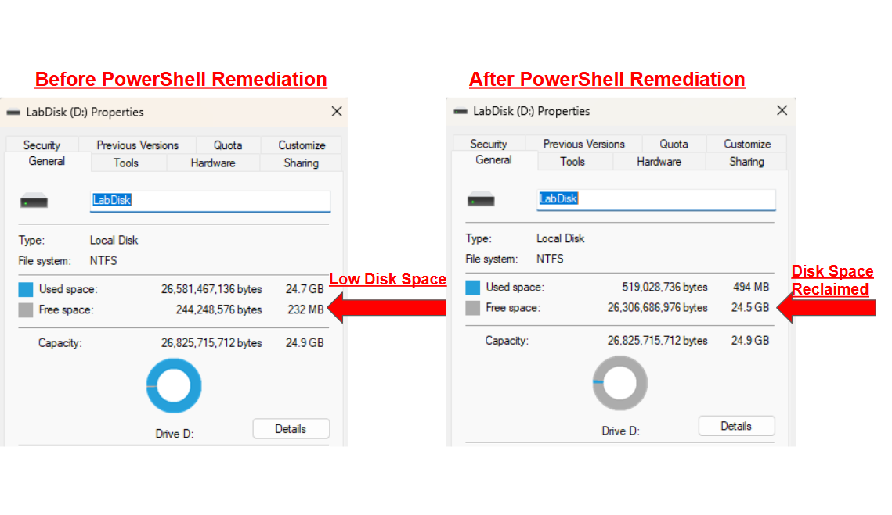
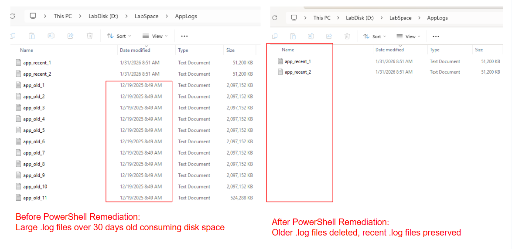
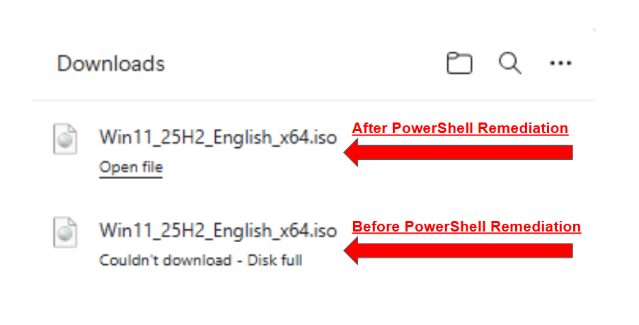

## Selective File Deletion

This shell demo shows a safe, repeatable approach to deleting files older than a defined cut-off date. The example targets accumulated historical .log and .tmp files that have contributed to low disk space on a target volume.  

## Troubleshooting Scenario

This method applies when users report failed downloads or installs due to insufficient available disk space. Historical files are selectively removed while recent files are preserved to avoid disrupting active processes.   


```powershell
$root = "D:\LabSpace"
$ext  = ".log",".tmp"

Get-ChildItem $root -Recurse -File |
Where-Object { $ext -contains $_.Extension } |
Where-Object LastWriteTime -lt (Get-Date).AddDays(-30) |
Remove-Item -Force
```

(see: [Troubleshooting Journal Repository T-0007](https://github.com/robohlstrom24/troubleshooting-journal))

## Screenshots



